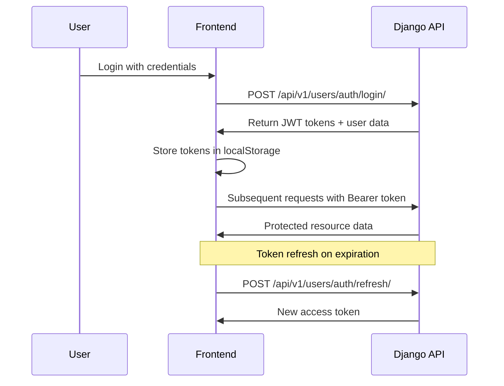

# Frontend-Backend Integration Documentation

## Overview

This document provides comprehensive details about the integration between the React frontend and Django backend for the Acharya School Management System. The integration process involved replacing Supabase authentication and data services with a custom Django REST API.

**Integration Date**: September 13, 2025  
**Frontend**: React 18 + TypeScript + Tailwind CSS + shadcn/ui  
**Backend**: Django 5.2.5 + Django REST Framework + SimpleJWT  

## 🔄 Integration Summary

### What Was Replaced
- **Supabase Authentication** → JWT Token-based Authentication
- **Supabase Database** → Django Models with PostgreSQL
- **Supabase Client** → Axios HTTP Client with interceptors
- **Supabase Types** → TypeScript interfaces for Django models
- **Mock Data** → Real API endpoints

### What Was Added
- Complete API service layer (`/src/lib/api/`)
- JWT authentication context (`/src/contexts/AuthContext.tsx`)
- TypeScript types for all Django models
- Error handling and loading states
- Token refresh mechanism
- Role-based access control

## 📁 Project Structure After Integration

```
frontend/
├── src/
│   ├── lib/
│   │   └── api/
│   │       ├── index.ts          # Main exports
│   │       ├── types.ts          # TypeScript interfaces
│   │       ├── client.ts         # Axios client with interceptors
│   │       ├── auth.ts           # Authentication services
│   │       └── services.ts       # All other API services
│   ├── contexts/
│   │   └── AuthContext.tsx       # JWT authentication provider
│   ├── pages/
│   │   ├── Auth.tsx              # New login system
│   │   ├── Dashboard.tsx         # Updated with auth context
│   │   ├── Admission.tsx         # Connected to Django API
│   │   └── dashboards/
│   │       ├── StudentDashboard.tsx   # Real API integration
│   │       ├── ParentDashboard.tsx    # Updated
│   │       ├── FacultyDashboard.tsx   # Updated
│   │       ├── AdminDashboard.tsx     # Updated
│   │       └── WardenDashboard.tsx    # Updated
│   └── App.tsx                   # Added AuthProvider
├── .env                          # Updated environment variables
└── package.json                  # Updated dependencies
```

## 🔐 Authentication System

### JWT Token Management

The new authentication system uses JSON Web Tokens with the following features:

#### Token Storage
```typescript
localStorage.setItem('access_token', response.access);
localStorage.setItem('refresh_token', response.refresh);
localStorage.setItem('user', JSON.stringify(response.user));
```

#### Automatic Token Refresh
```typescript
// Implemented in /src/lib/api/client.ts
client.interceptors.response.use(
  (response) => response,
  async (error) => {
    if (error.response?.status === 401 && !originalRequest._retry) {
      // Attempt token refresh
      const refreshToken = localStorage.getItem('refresh_token');
      if (refreshToken) {
        const response = await refreshTokenAPI(refreshToken);
        // Retry original request with new token
      }
    }
  }
);
```

#### Role-Based Access
```typescript
interface User {
  id: number;
  email: string;
  role: 'student' | 'parent' | 'faculty' | 'warden' | 'admin';
  first_name: string;
  last_name: string;
}

// Usage in components
const { user, isAuthenticated } = useAuth();
if (user?.role === 'student') {
  // Show student-specific content
}
```

### Authentication Flow



## 🔌 API Integration Details

### Base Configuration

```typescript
// Environment Variables (.env)
VITE_API_BASE_URL=http://localhost:8000/api/v1/

// API Client Setup
const apiClient = axios.create({
  baseURL: process.env.VITE_API_BASE_URL,
  timeout: 30000,
  headers: {
    'Content-Type': 'application/json',
  },
});
```

### Service Layer Architecture

#### Authentication Service (`auth.ts`)
```typescript
export const authService = {
  login: async (credentials: LoginCredentials): Promise<AuthResponse>
  logout: async (): Promise<void>
  getCurrentUser: async (): Promise<{ user: User; profile: any }>
  isAuthenticated: (): boolean
  refreshToken: async (): Promise<{ access: string }>
}
```

#### Data Services (`services.ts`)
```typescript
// Admission Service
export const admissionService = {
  submitApplication: (data: Partial<AdmissionApplication>): Promise<AdmissionApplication>
  getApplications: (params?: any): Promise<ApiResponse<AdmissionApplication[]>>
  reviewApplication: (id: number, data: ReviewData): Promise<AdmissionApplication>
}

// Fee Service
export const feeService = {
  getInvoices: (params?: any): Promise<ApiResponse<FeeInvoice[]>>
  processPayment: (id: number, data: PaymentData): Promise<PaymentResponse>
  getPayments: (params?: any): Promise<ApiResponse<Payment[]>>
}

// Attendance Service
export const attendanceService = {
  markAttendance: (data: AttendanceData): Promise<{ message: string }>
  getAttendanceRecords: (params?: any): Promise<ApiResponse<AttendanceRecord[]>>
  getSessions: (params?: any): Promise<ApiResponse<ClassSession[]>>
}

// Additional services for exams, hostel, library, notifications...
```

### TypeScript Integration

#### Complete Type Definitions
```typescript
// User and Profile Types
interface User {
  id: number;
  email: string;
  role: 'student' | 'parent' | 'faculty' | 'warden' | 'admin';
  first_name: string;
  last_name: string;
  phone_number?: string;
  is_active: boolean;
  date_joined: string;
}

interface StudentProfile {
  id: number;
  user: number;
  admission_number: string;
  course: string;
  semester: number;
  is_hostelite: boolean;
}

// API Response Types
interface ApiResponse<T> {
  count?: number;
  next?: string;
  previous?: string;
  results: T;
}

interface ApiError {
  error: string;
  details?: Record<string, string[]>;
  status?: number;
}
```

## 📊 Dashboard Integration

### StudentDashboard.tsx

The student dashboard now fetches real data from multiple API endpoints:

```typescript
const loadDashboardData = async () => {
  const [feesData, attendanceData, resultsData, libraryData, noticesData] = 
    await Promise.allSettled([
      feeService.getInvoices({ student: user?.id }),
      attendanceService.getAttendanceRecords({ student: user?.id }),
      examService.getExamResults({ student: user?.id }),
      libraryService.getBorrowRecords({ student: user?.id }),
      notificationService.getNotices({ target_roles: ['student', 'all'] }),
    ]);
};
```

#### Features Implemented:
- **Real-time Data**: Live fee status, attendance records, exam results
- **Interactive Elements**: Pay fees button, attendance percentage display
- **Error Handling**: Graceful error handling with toast notifications
- **Loading States**: Skeleton loading during data fetch
- **Role-based Access**: Only shows relevant data for student role

### Other Dashboards

Similar integration patterns applied to:
- **ParentDashboard**: Children's data, fee notifications, progress tracking
- **FacultyDashboard**: Class management, attendance marking, grade entry
- **AdminDashboard**: System-wide statistics, user management
- **WardenDashboard**: Hostel management, room allocations

## 📝 Form Integration

### Admission Form (`Admission.tsx`)

Complete rewrite to integrate with Django API:

```typescript
const handleSubmit = async (e: React.FormEvent) => {
  e.preventDefault();
  
  if (!validateForm()) return;
  
  try {
    const applicationData: Partial<AdmissionApplication> = {
      applicant_name: formData.applicant_name,
      date_of_birth: formData.date_of_birth,
      course_applied: formData.course_applied,
      phone_number: formData.phone_number,
      email: formData.email,
      address: formData.address,
      previous_school: formData.previous_school,
      last_percentage: parseFloat(formData.last_percentage),
    };

    const response = await admissionService.submitApplication(applicationData);
    
    setApplicationId(response.id!);
    setIsSubmitted(true);
    
    toast({
      title: "Application Submitted Successfully!",
      description: `Reference ID: ${response.id}`,
    });
  } catch (error: any) {
    toast({
      title: "Submission Failed",
      description: error.error || "Please try again.",
      variant: "destructive",
    });
  }
};
```

#### Features:
- **Real API Integration**: Submits to Django backend
- **Validation**: Client-side validation with error messages
- **Success Handling**: Shows application ID and next steps
- **Error Recovery**: Graceful error handling with user feedback

## 🔧 Error Handling & User Experience

### Global Error Handling

```typescript
// API Client Interceptor
client.interceptors.response.use(
  (response) => response,
  async (error) => {
    const apiError: ApiError = {
      error: error.response?.data?.error || error.message,
      details: error.response?.data?.details,
      status: error.response?.status,
    };
    return Promise.reject(apiError);
  }
);

// Component Usage
try {
  await apiCall();
} catch (error: any) {
  toast({
    title: "Error",
    description: error.error || "Something went wrong",
    variant: "destructive",
  });
}
```

### Loading States

```typescript
const [loading, setLoading] = useState(false);

const loadData = async () => {
  try {
    setLoading(true);
    const data = await apiService.getData();
    // Handle success
  } catch (error) {
    // Handle error
  } finally {
    setLoading(false);
  }
};

// UI Component
{loading ? (
  <div className="flex items-center justify-center">
    <Clock className="h-8 w-8 animate-spin" />
    <span>Loading...</span>
  </div>
) : (
  <DataComponent />
)}
```

## 🚀 Deployment Configuration

### Environment Variables

```bash
# Development
VITE_API_BASE_URL=http://localhost:8000/api/v1/

# Production
VITE_API_BASE_URL=https://api.acharya.edu/api/v1/
```

### Build Configuration

```json
{
  "scripts": {
    "dev": "vite",
    "build": "vite build",
    "build:dev": "vite build --mode development",
    "preview": "vite preview"
  }
}
```

### Docker Integration

```dockerfile
# Dockerfile for frontend
FROM node:18-alpine

WORKDIR /app
COPY package*.json ./
RUN npm install

COPY . .
ARG VITE_API_BASE_URL
ENV VITE_API_BASE_URL=$VITE_API_BASE_URL

RUN npm run build

FROM nginx:alpine
COPY --from=0 /app/dist /usr/share/nginx/html
COPY nginx.conf /etc/nginx/nginx.conf

EXPOSE 80
CMD ["nginx", "-g", "daemon off;"]
```

## 🔍 Testing Strategy

### API Testing
```typescript
// Example test for authentication service
describe('AuthService', () => {
  test('should login successfully', async () => {
    const credentials = { email: 'test@example.com', password: 'password' };
    const response = await authService.login(credentials);
    
    expect(response).toHaveProperty('access');
    expect(response).toHaveProperty('refresh');
    expect(response).toHaveProperty('user');
  });
});
```

### Component Testing
```typescript
// Example test for Dashboard component
describe('StudentDashboard', () => {
  test('should display loading state initially', () => {
    render(<StudentDashboard />);
    expect(screen.getByText('Loading your dashboard...')).toBeInTheDocument();
  });
});
```

## 📋 API Endpoint Mapping

### Authentication Endpoints
| Frontend Function | Django Endpoint | Method | Description |
|------------------|-----------------|--------|-------------|
| `authService.login()` | `/users/auth/login/` | POST | User login |
| `authService.logout()` | `/users/auth/logout/` | POST | User logout |
| `authService.getCurrentUser()` | `/users/auth/me/` | GET | Get current user |
| `authService.refreshToken()` | `/users/auth/refresh/` | POST | Refresh token |

### Data Endpoints
| Frontend Function | Django Endpoint | Method | Description |
|------------------|-----------------|--------|-------------|
| `admissionService.submitApplication()` | `/admissions/applications/` | POST | Submit admission |
| `feeService.getInvoices()` | `/fees/invoices/` | GET | Get fee invoices |
| `feeService.processPayment()` | `/fees/invoices/{id}/pay/` | POST | Process payment |
| `attendanceService.getRecords()` | `/attendance/records/` | GET | Get attendance |
| `examService.getResults()` | `/exams/results/` | GET | Get exam results |
| `libraryService.getBooks()` | `/library/books/` | GET | Get library books |
| `notificationService.getNotices()` | `/notifications/notices/` | GET | Get notices |

## 🔧 Development Workflow

### Setting Up Development Environment

1. **Backend Setup**
```bash
cd backend
uv sync
uv run manage.py migrate
uv run manage.py createsuperuser
uv run manage.py runserver
```

2. **Frontend Setup**
```bash
cd frontend
npm install
npm run dev
```

3. **Environment Configuration**
```bash
# frontend/.env
VITE_API_BASE_URL=http://localhost:8000/api/v1/
```

### Development Commands

```bash
# Frontend Development
npm run dev          # Start development server
npm run build        # Build for production
npm run preview      # Preview production build
npm run lint         # Run ESLint

# Backend Development
uv run manage.py runserver        # Start Django server
uv run manage.py makemigrations   # Create migrations
uv run manage.py migrate          # Apply migrations
uv run manage.py test             # Run tests
```

## 🚨 Common Issues & Solutions

### Issue 1: CORS Errors
**Problem**: Frontend can't connect to backend due to CORS policy
**Solution**: 
```python
# backend/config/settings.py
CORS_ALLOWED_ORIGINS = [
    "http://localhost:5173",  # Vite dev server
    "http://localhost:3000",  # Alternative port
]
```

### Issue 2: Token Expiration
**Problem**: 401 errors after token expires
**Solution**: Implemented automatic token refresh in API client

### Issue 3: Type Errors
**Problem**: TypeScript errors with API responses
**Solution**: Complete type definitions in `/src/lib/api/types.ts`

### Issue 4: Loading States
**Problem**: Poor UX during API calls
**Solution**: Implemented loading spinners and skeleton states

## 📚 Next Steps & Enhancements

### Immediate Improvements
1. **File Upload**: Implement S3 integration for document uploads
2. **Real-time Features**: WebSocket integration for notifications
3. **Offline Support**: Service worker for offline functionality
4. **Performance**: Implement React Query for better caching

### Long-term Enhancements
1. **Mobile App**: React Native integration using same API
2. **Analytics**: Advanced reporting and analytics dashboard
3. **Automation**: Automated testing and deployment pipelines
4. **Scalability**: CDN integration and performance optimization

## 💡 Best Practices Implemented

### Security
- JWT token management with automatic refresh
- Secure token storage considerations
- Role-based access control
- Input validation on both frontend and backend

### Performance
- Lazy loading of dashboard components
- Optimistic UI updates
- Efficient API calls with Promise.allSettled
- Proper error boundaries

### User Experience
- Consistent loading states
- Informative error messages
- Toast notifications for user feedback
- Responsive design for all screen sizes

### Code Quality
- TypeScript for type safety
- Consistent naming conventions
- Modular service architecture
- Comprehensive error handling

---

## 📞 Support & Maintenance

### Code Documentation
- All API services are documented with TypeScript interfaces
- Component props and usage examples included
- Error handling patterns documented

### Monitoring
- Frontend errors tracked via toast notifications
- API errors logged for debugging
- User authentication events tracked

### Updates
- Backend API versioning strategy in place
- Frontend dependency management with npm
- Environment-specific configurations

This integration provides a solid foundation for the Acharya School Management System with room for future enhancements and scalability.